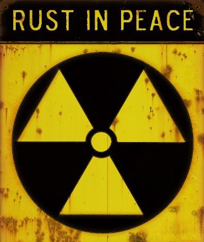

##My first day with Rust (_in_peace 666)!

[Hit The Demo](https://focused-booth-bb8cdc.netlify.com/)

New to Rust? stuff to install:
- [Get Rust](https://www.rust-lang.org/tools/install)
- [Get cargo (rust package manager, like npm)](https://crates.io/).

Here for WebAssembly?
- Install: wasm-pack (building, testing, and publishing Rust-generated WebAssembly).

How to build this project?
- `npm i`
- `npm run serve`

